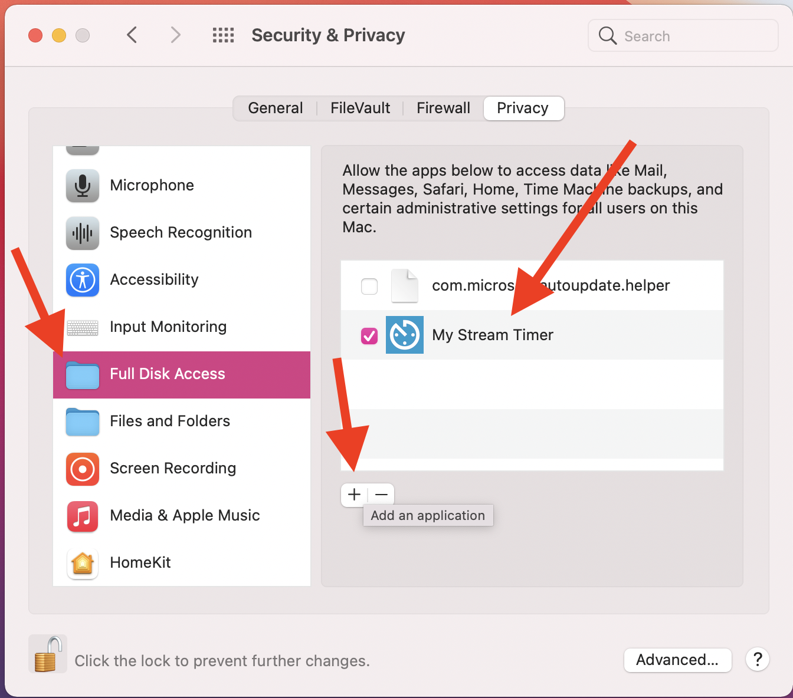

# My Stream Timer
My Stream Timer is an easy to use countdown and count-up timer for streamers. Multiple timers are available that write a file to disk to use with OBS, SLOBS, or your favorite streaming application. Have it auto start so it works with Stream Deck!


Download today on Windows or macOS:
* Windows 10 via the [Microsoft Store](https://www.microsoft.com/p/my-stream-timer/9n5nxx3wk7k7?WT.mc_id=friends-0000-jamont)
* macOS 10.10+ via the [App Store](https://itunes.apple.com/us/app/my-stream-timer/id1460539461?mt=12)


Unable to download from the Microsoft Store on Windows? Download from [App Center](https://install.appcenter.ms/orgs/refractored-llc/apps/my-stream-timer/distribution_groups/public%20mystreamtimer)

## Integrating into OBS/SLOBS

Open My Stream Timer and tap the copy icon to copy the location on disk where My Stream Timer saves output files.


Next, Open OBS/SLOBS and add a **Text** source. Check "Read from file" and click browse and navigate location that was copied to the clipboard. Select on of the text files for count down, up, or giveaway. That's it! When you start the countdown it will show up!


If you are on macOS when you set click "Browse" in OBS/SLOBS the file picker will come up. To browse to a folder use the following command on your keyboard: (CMD + SHIFT + G) and then paste the directory from My Stream Timer

## Integrating into Stream Deck

You can integrate a **Website** command under **System** to launch My Stream Timer and start a countdown from a specific amount of time. You don't need to browse for a file location at all as you can input a protocol url:

* Count down from X minutes: mystreamtimer://countdown/?mins=6
* Count down to specific time (24 hour clock): mystreamtimer://countdown/?to=15:30
* Count down to top of the hour: mystreamtimer://countdown/?topofhour

## Integrating into Command Line

My Stream Timer uses standard protocals to work via the command line. For example you can call the following on the Windows command line:

```
start mystreamtimer://countdown/?mins=6
```

## Integrating into Deckboard (using an Extension App for Windows)
If you do not own a Stream Deck but use other apps to control your stream, [Dara Oladapo](https://twitter.com/daraoladapo) created an extension app for Windows that he uses for Deckboard. You can check out the project [here](https://github.com/DaraOladapo/stream-deckboard) and web link [here](https://daraoladapo.github.io/stream-deckboard/).

## In Action

View the walkthrough on [YouTube](https://youtu.be/j_GdGIdDRxI)

## Troubleshooting

My Stream Timer should work out of the box, but if it doesn't here are some tips and tricks.

### macOS: Files can't be saved
In some instances My Stream Timer may need full file accessed based on your setup (This is rare). Head to **Preferences > Security & Privacy > Full Disk Access** Unlock to add My Stream Timer from your application folder.



### macOS: I dont' hear any "beeps"
My Stream Timer uses the native device sound effects. This means you can make the beeps whatever you would like, but you have to turn them on. Head to **Preferences > Sound > Sound Effects**. Ensure that **Play user interface sound effects** is turned on and that it is set to playback through the speaker you would like to use.


