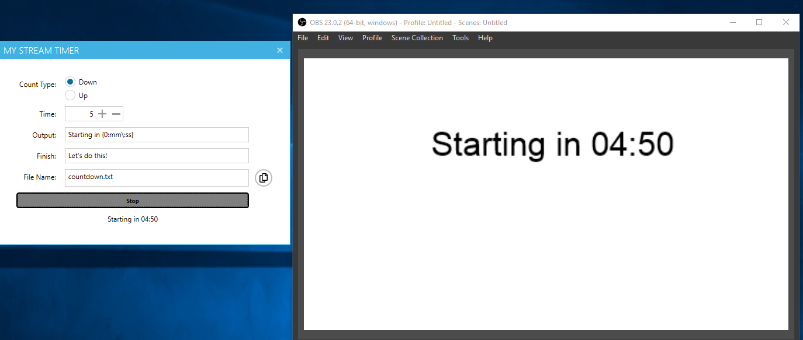
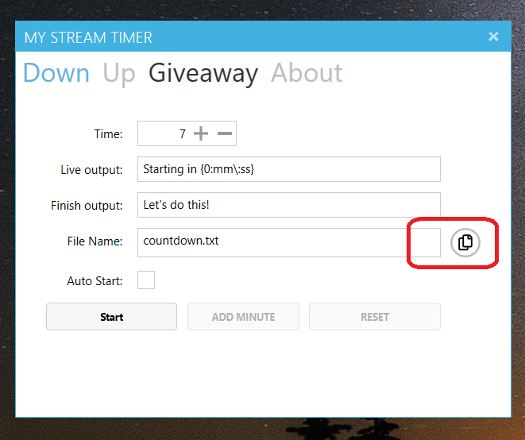
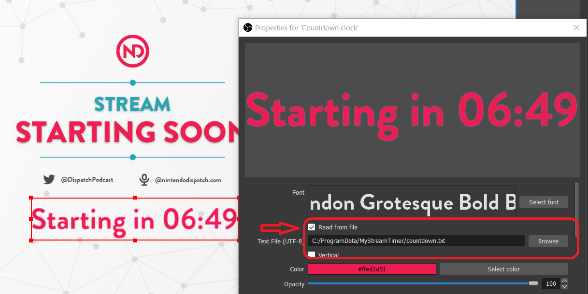
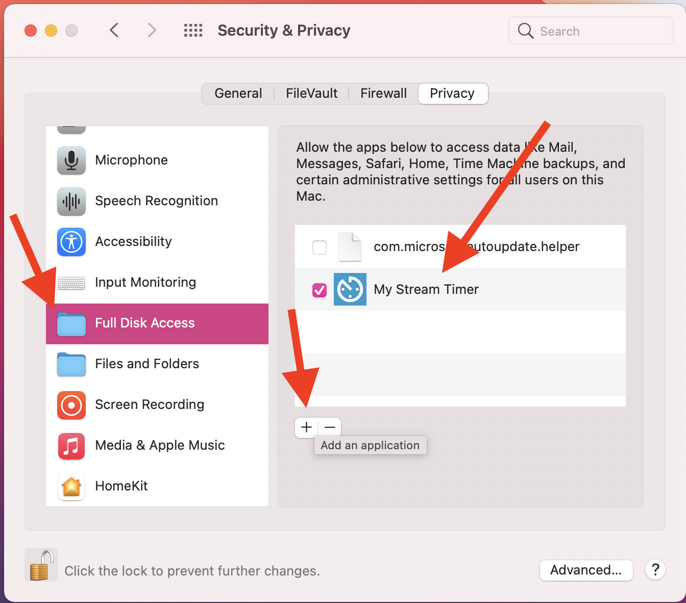

# My Stream Timer
My Stream Timer is an easy to use countdown and count-up timer for streamers. Multiple timers are available that write a file to disk to use with OBS, SLOBS, or your favorite streaming application. Have it auto start so it works with Stream Deck!


Download today on Windows or macOS:
* Windows 10 (1809+) / Windows 11 via the [Microsoft Store](https://www.microsoft.com/p/my-stream-timer/9n5nxx3wk7k7?WT.mc_id=friends-0000-jamont)
* macOS via the [App Store](https://itunes.apple.com/us/app/my-stream-timer/id1460539461?mt=12)



The Windows app is distributed exclusively through the Microsoft Store (Pro features use Store licensing). Releases are submitted automatically by the [Windows Store Publish](.github/workflows/windows-store-publish.yml) workflow when a `vX.Y.Z-windows` tag is pushed.

## What's new in 3.0 (Windows)

My Stream Timer for Windows was rewritten from the ground up in **WinUI 3 / Windows App SDK** with a modern Fluent design. Everything you had configured before — timer settings, file names, output folder and Pro unlocks — carries over automatically.

* Sidebar navigation, Mica, Light/Dark/System themes
* **Rename timers and pick an icon** for each one (Settings › Timers)
* **Pop‑out timer windows** (Pro) with custom font, size and colours — great on a second monitor or pinned over OBS
* **Automation page** with a command builder that generates `mystreamtimer://` URLs for Stream Deck and scripts
* Output folder management (choose, test access, open in Explorer), per‑timer **+1 / −1 minute**, keyboard shortcuts (Space start/stop, P pause, R reset, Ctrl+Shift+1…7 switch timers)
* Pro **subscriptions** (monthly / 6 months) in addition to the lifetime tiers
* New automation host: `mystreamtimer://time/?start` and `?stop` for the clock timer
* Keeps your PC awake while a timer is running — no more "do not minimize" warning

## Integrating into OBS/SLOBS

Open My Stream Timer and tap the copy icon to copy the location on disk where My Stream Timer saves output files.



Next, Open OBS/SLOBS and add a **Text** source. Check "Read from file" and click browse and navigate location that was copied to the clipboard. Select on of the text files for count down, up, or giveaway. That's it! When you start the countdown it will show up!



If you are on macOS when you set click "Browse" in OBS/SLOBS the file picker will come up. To browse to a folder use the following command on your keyboard: (CMD + SHIFT + G) and then paste the directory from My Stream Timer

## End sounds

Every countdown and count-up timer has its own sound settings on its timer page, so each timer can use a different sound. Choose **Default beep**, **Chime**, **Bell**, **Digital**, or **Custom**, and use **Preview** to hear it. The four built-in sounds are original synthesized WAV files included with each app; Default beep uses the classic three-beep pattern.

- **Countdowns:** turn on **Beep at zero** to play the timer's sound when it finishes.
- **Count ups:** turn on **Play sound at time** and set the minutes and seconds. The sound plays once when the count up reaches that time, and the timer keeps counting. Resuming a paused count up that is already past the time does not replay the sound.

For **Custom**, choose an MP3 or WAV file (`.mp3`, `.wav`, or `.wave`) for that timer. The selection is saved between app launches. Keep the file available in its selected location; if it cannot be played, the app falls back to Default beep.

## Menu bar timers (macOS, Pro)

On macOS, any timer can have its own menu bar item. Turn on **Show in menu bar** on a timer's page, or pick several at once under **Settings › Menu bar timers**.

- An idle timer shows its icon. A running timer shows the icon and the timer's output, in the format you set for it, so it matches the timer's output file. A paused timer shows a pause icon with the output it stopped at. Output longer than 32 characters is cut off with an ellipsis.
- Click the item to start, stop, pause, resume, add a minute, reset, open the app on that timer, or hide the item.
- While at least one timer is in the menu bar, My Stream Timer keeps running after you close its window, and timers keep writing their output files. Use **Quit My Stream Timer** in the menu to quit.

## Integrating into Stream Deck

The official My Stream Timer plugin is in [`MyStreamTimer.StreamDeck`](MyStreamTimer.StreamDeck). It provides configurable actions for every countdown, count-up, and Current Time output, including start, add/subtract, pause, resume, reset, and stop. A Start Timer action can also run an independent countdown that writes directly to a text file without launching the app.

Plugin releases are attached to GitHub tags such as `v2.0.0-streamdeck`. Existing buttons from the legacy plugin must be removed and re-added because version 2 uses new plugin and action identifiers.

You can also integrate a **Website** command under **System** using a protocol URL:

* Count down from X minutes: mystreamtimer://countdown/?mins=6
* Count down to specific time (24 hour clock): mystreamtimer://countdown/?to=15:30
* Count down to top of the hour: mystreamtimer://countdown/?topofhour

## Integrating into Command Line

My Stream Timer uses standard protocals to work via the command line. For example you can call the following on the Windows command line:

```
start mystreamtimer://countdown/?mins=6
```

Here are the list of commands:
* mystreamtimer://countdown/?mins=6
* mystreamtimer://countdown/?secs=90
* mystreamtimer://countdown/?topofhour
* mystreamtimer://countdown/?to=15:30
* mystreamtimer://countdown/?addmins=1 · ?addsecs=30 · ?subtractmins=1 · ?subtractsecs=30
* mystreamtimer://countdown/?pause · ?resume · ?reset · ?stop
* mystreamtimer://time/?start · ?stop (clock timer, Pro)

**countdown** can be replaced with: **countdown2**, **countdown3**, **countdown4**, **countup**, **countup2** depending on which one you would like to control. The Automation page in the app builds these URLs for you.

## Integrating into Deckboard (using an Extension App for Windows)
If you do not own a Stream Deck but use other apps to control your stream, [Dara Oladapo](https://twitter.com/daraoladapo) created an extension app for Windows that he uses for Deckboard. You can check out the project [here](https://github.com/DaraOladapo/stream-deckboard) and web link [here](https://daraoladapo.github.io/stream-deckboard/).

## In Action

View the walkthrough on [YouTube](https://youtu.be/j_GdGIdDRxI)

## Building from source (Windows)

Requires the .NET 10 SDK, the [WinApp CLI](https://aka.ms/winapp) and Developer Mode.

```
dotnet test tests\MyStreamTimer.Core.Tests
dotnet build src\MyStreamTimer.WinUI\MyStreamTimer.WinUI.csproj -p:Platform=x64
cd src\MyStreamTimer.WinUI && dotnet run
```

Debug builds install side‑by‑side with the Store app under a `*.Dev` identity (protocol `mystreamtimer-dev://`). Release builds use the Store identity. The migration plan, design spec and upgrade‑test checklist live in `winui-migration/`.

## Troubleshooting

My Stream Timer should work out of the box, but if it doesn't here are some tips and tricks.

### macOS: Files can't be saved
In some instances My Stream Timer may need full file accessed based on your setup (This is rare). Head to **Preferences > Security & Privacy > Full Disk Access** Unlock to add My Stream Timer from your application folder.



### macOS: I dont' hear any "beeps"
Enable **Beep at zero** (or **Play sound at time** for a count up) on the timer, then use **Preview** next to that timer's sound. Check your system output device and volume in **System Settings > Sound**. End sounds play as app audio rather than using the system alert sound. If a custom file is no longer accessible or cannot be decoded, choose it again or select a built-in sound.

